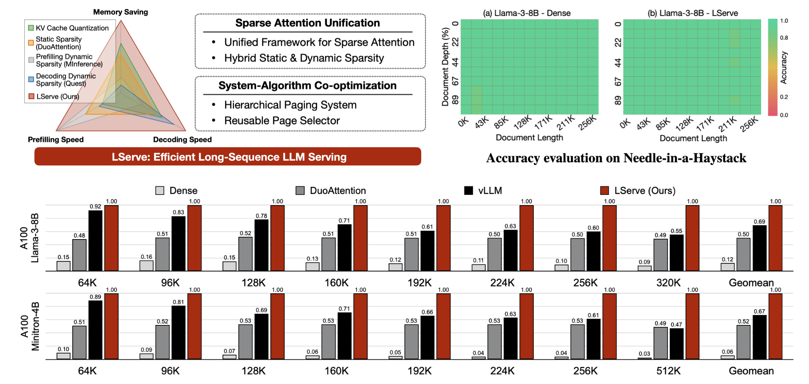
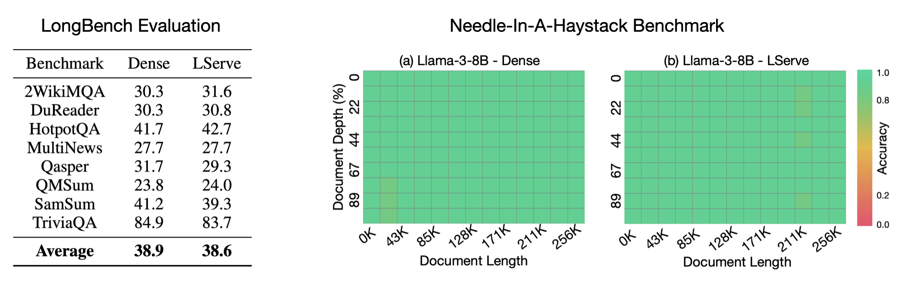
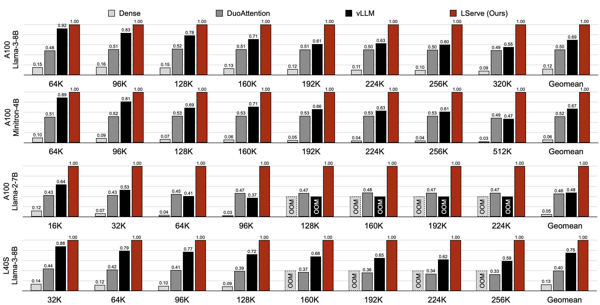

# OmniServe: Unified and Efficient Inference Engine for Large-Scale LLM Serving

**[Paper (QServe)](https://arxiv.org/abs/2405.04532) | [Paper (LServe)](https://arxiv.org/abs/2502.14866) | [Website (QServe)](https://hanlab.mit.edu/projects/qserve) | [Website (LServe)](https://hanlab.mit.edu/projects/lserve)**

OmniServe aims to revolutionize large-scale LLM serving by unifying and optimizing key advancements in both low-bit quantization and long-context processing. OmniServe integrates the innovations from [QServe](https://arxiv.org/abs/2405.04532), which boosts efficiency with W4A8KV4 quantization and reduces dequantization overheads, and [LServe](https://arxiv.org/abs/2502.14866), which accelerates long-context LLM inference through unified sparse attention and hierarchical KV cache management. OmniServe delivers a comprehensive solution for scalable and cost-effective LLM deployment. This unified system addresses the dual challenges of computational complexity and memory overhead, achieving significant speedups in both prefill and decoding stages, while also maximizing GPU throughput and minimizing infrastructure costs.

## News
- [2025/02] 🔥 **OmniServe is now publicly available!** OmniServe has integrated optimizations from both QServe and LServe into one single LLM inference framework. Experience efficient and accurate inference for both [long-context](#lserve-efficient-long-sequence-llm-serving-with-unified-sparse-attention) and [quantized](#qserve-w4a8kv4-quantization-and-system-co-design-for-efficient-llm-serving) LLMs with OmniServe now!
- [2025/02] 🏆 Both **QServe and LServe have been accepted by MLSys 2025**!
- [2024/12] 🔥 QServe has been integrated into NVIDIA [TensorRT-LLM](https://github.com/NVIDIA/TensorRT-LLM/blob/main/examples/llama/README.md#w4aint8-quantization-qserve)!
- [2024/05] 🔥 QServe is publicly released! Check our paper [here](https://arxiv.org/abs/2405.04532).


## Key Features
**OmniServe** is a unified, flexible, and efficient LLM serving system designed to support modern large language models and multi-modal language models. With configurable quantization precisions and hybrid sparse attention patterns, OmniServe integrates the strengths of [QServe](#qserve-w4a8kv4-quantization-and-system-co-design-for-efficient-llm-serving) and [LServe](#lserve-efficient-long-sequence-llm-serving-with-unified-sparse-attention), enabling efficient processing of both large-batch and long-context inputs, significantly reducing LLM serving costs while maintaining high response quality.

## Contents
- [Installation](#installation)
- [OmniServe Model Zoo](#omniserve-model-zoo)

- [QServe: ***W4A8KV4*** Quantization and System Co-design for Efficient LLM Serving](#qserve-w4a8kv4-quantization-and-system-co-design-for-efficient-llm-serving)
  - [Introduction](#introduction)
  - [Usage and Examples](#usage-and-examples)
  - [Results](#results)
    - [Accuracy Evaluation](#accuracy-evaluation)
    - [Efficiency Benchmarks](#efficiency-benchmarks)


- [LServe: Efficient Long-Sequence LLM Serving with ***Unified Sparse Attention***](#lserve-efficient-long-sequence-llm-serving-with-unified-sparse-attention)
  - [Introduction](#introduction-1)
  - [Usage and Examples](#usage-and-examples-1)
  - [Results](#results-1)
    - [Accuracy Evaluation](#accuracy-evaluation-1)
    - [Efficiency Benchmarks](#efficiency-benchmarks-1)


- [Reference](#reference)
- [Team](#team)
- [Related Projects](#related-projects)
- [Acknowledgement](#acknowledgement)


## Installation

1. Clone this repository and navigate to the corresponding folder:
```bash
git clone https://github.com/mit-han-lab/OmniServe
cd OmniServe
```

2. Install OmniServe

2.1 LLM setup tutorial

If you hope to serve text-only LLMs, please follow the tutorial below:

```bash
conda create -n OmniServe python=3.10 -y
conda activate OmniServe
pip install --upgrade pip  # enable PEP 660 support

conda install -c nvidia cuda-toolkit -y  # This is optional if you prefer to use built-in nvcc

# Install OmniServe package
pip install -e .
pip install flash-attn --no-build-isolation
```

We recommend starting an interactive python CLI interface and run `import flash_attn` to check whether FlashAttention-2 is installed successfully. If not, we recommend downloading pre-built wheels from [here](https://github.com/Dao-AILab/flash-attention/releases/tag/v2.5.8). Please notice:

- PyTorch version needs to exactly match with the version specified in the `.whl` name;
- Check out both `cxx11abiTRUE` and `cxx11abiFALSE` wheels if one of them does not work;
- It's recommended to match CUDA version specified in the `.whl` filename, but minor mismatches (e.g. 12.1 vs 12.2, or even 11.8 vs 12.2) usually do not matter.

2.2 Sparse prefilling with [Block-Sparse-Attention](https://github.com/mit-han-lab/Block-Sparse-Attention).

We provide pre-built wheels for Block-Sparse-Attention [here](https://github.com/mit-han-lab/Block-Sparse-Attention/releases). Please download and install the `.whl` file with pip according to your environment. Similar to `flash_attn`, We recommend starting an interactive python CLI interface and run `import block_sparse_attn` to check the installation. Please also notice:

- PyTorch version needs to exactly match with the version specified in the `.whl` name;
- Check out both `cxx11abiTRUE` and `cxx11abiFALSE` wheels if one of them does not work;
- It's recommended to match CUDA version specified in the `.whl` filename, but minor mismatches (e.g. 12.1 vs 12.2, or even 11.8 vs 12.2) usually do not matter.

To build Block-Sparse-Attention from source, please follow the instructions below:

```bash
git clone https://github.com/mit-han-lab/Block-Sparse-Attention.git --recursive
cd Block-Sparse-Attention

pip install packaging
pip install ninja
python setup.py install
```


<!-- 2.2 [Optional] VLM setup tutorial

QServe also supports synthetic caption generation with VILA VLMs. Please follow the [tutorial](#qserve-vlm-installation) for installation details. -->


3. Compile the CUDA kernels for OmniServe.

Please return to the OmniServe directory and execute the following commands:

```bash
pip install ninja   # Install ninja if not already

cd kernels
python setup.py install
```

4. If you want to clone our model zoo, please make sure that `git-lfs` is installed.

## OmniServe Model Zoo

We provide pre-quantized checkpoints for multiple model families. For example, for Llama-3-8B model, please run the following commands to download:

```bash
# git lfs install  # install git lfs if not already
mkdir -p qserve_checkpoints && cd qserve_checkpoints
git clone https://huggingface.co/mit-han-lab/Llama-3-8B-Instruct-QServe 
```

For other models, please refer to the detailed support list for the links to download:

| Models    | W4A8-per-channel     |  W4A8-g128       |
| --------- | ---------------------- | -------------- | 
| Llama3    | ✅   [8B](https://huggingface.co/mit-han-lab/Llama-3-8B-QServe)/70B          |  ✅  [8B](https://huggingface.co/mit-han-lab/Llama-3-8B-QServe-g128)/70B|
| Llama3-Instruct   | ✅   [8B](https://huggingface.co/mit-han-lab/Llama-3-8B-Instruct-QServe)/70B          | ✅  [8B](https://huggingface.co/mit-han-lab/Llama-3-8B-Instruct-QServe-g128)/70B              |
| Llama2    |  ✅  [7B](https://huggingface.co/mit-han-lab/Llama-2-7B-QServe)/[13B](https://huggingface.co/mit-han-lab/Llama-2-13B-QServe)/70B           | ✅ [7B](https://huggingface.co/mit-han-lab/Llama-2-7B-QServe-g128)/[13B](https://huggingface.co/mit-han-lab/Llama-2-13B-QServe-g128)/70B               
| Vicuna    | ✅  [7B](https://huggingface.co/mit-han-lab/vicuna-7b-v1.5-QServe)/[13B](https://huggingface.co/mit-han-lab/vicuna-13b-v1.5-QServe)/30B           | ✅ [7B](https://huggingface.co/mit-han-lab/vicuna-7b-v1.5-QServe-g128)/[13B](https://huggingface.co/mit-han-lab/vicuna-13b-v1.5-QServe-g128)/30B               |
| Mistral   | ✅  [7B](https://huggingface.co/mit-han-lab/Mistral-7B-v0.1-QServe)           | ✅  [7B](https://huggingface.co/mit-han-lab/Mistral-7B-v0.1-QServe-g128)               |
| Yi        | ✅    [34B](https://huggingface.co/mit-han-lab/Yi-34B-QServe)         | ✅   [34B](https://huggingface.co/mit-han-lab/Yi-34B-QServe-g128)             |
| Qwen      |✅    72B         | ✅      72B          |

For flagship datacenter GPUs such as the A100, it is recommended to use QServe-per-channel, while for inference datacenter GPUs like the L40S, QServe-per-group is the recommended approach.

If you are interested in generating the quantized checkpoints on your own, please follow the instructions in [DeepCompressor Library](https://github.com/mit-han-lab/deepcompressor/tree/lmquant-v0.0.0-deprecated) to run QoQ quantization and dump the fake-quantized models. We then provide checkpoint converter to real-quantize and pack the model into QServe format:

```bash
python checkpoint_converter.py --model-path <hf-model-path> --quant-path <fake-quant-model-path> --group-size -1 --device cpu
# <fake-quant-model-path> is a directory generated by DeepCompressor, including model.pt and scale.pt
```
We also provide a [script](./scripts/ckpt_converter/convert.sh) to run the checkpoint converter. The final model will be automatically stored under `qserve_checkpoints`. 


# QServe: ***W4A8KV4*** Quantization and System Co-design for Efficient LLM Serving

**[Paper](https://arxiv.org/abs/2405.04532) | [Website](https://hanlab.mit.edu/projects/qserve) | [DeepCompressor Library](https://github.com/mit-han-lab/deepcompressor/tree/lmquant-v0.0.0-deprecated)**

**QServe: Efficient and accurate LLM serving system** on GPUs with W4A8KV4 quantization (4-bit weights, 8-bit activations, and 4-bit KV cache). Compared with leading industry solution TensorRT-LLM, QServe achieves **1.2x-1.4x higher throughput** when serving Llama-3-8B, and **2.4x-3.5x higher throughput** when serving Qwen1.5-72B, on L40S and A100 GPUs. QServe also allows users to achieve A100-level throughput on **3x cheaper** L40S GPUs.  

QServe is suitable for **large-scale synthetic data generation** with both LLMs and VLMs. Check out our latest [QServe-VLM](#qserve-vlm) release!


## Introduction

Quantization can accelerate large language model (LLM) inference. Going beyond INT8 quantization, the research community is actively exploring even lower precision, such as INT4. Nonetheless, state-of-the-art INT4 quantization techniques only accelerate low-batch, edge LLM inference, failing to deliver performance gains in large-batch, cloud-based LLM serving. We uncover a critical issue: existing INT4 quantization methods suffer from significant runtime overhead (20-90%) when **dequantizing either weights or partial sums** on GPUs. To address this challenge, we introduce **QoQ**, a W4A8KV4 quantization algorithm with 4-bit weight, 8-bit activation, and 4-bit KV cache. QoQ stands for **quattuor-octo-quattuor**, which represents 4-8-4 in Latin. QoQ is implemented by the **QServe** inference library that achieves measured speedup. The key insight driving QServe is that the efficiency of LLM serving on GPUs is critically influenced by **operations on low-throughput CUDA cores**. Building upon this insight, in QoQ algorithm, we introduce progressive quantization that can allow low dequantization overhead in W4A8 GEMM. Additionally, we develop SmoothAttention to effectively mitigate the accuracy degradation incurred by 4-bit KV quantization. In the QServe system, we perform compute-aware weight reordering and take advantage of register-level parallelism to reduce dequantization latency. We also make fused attention memory-bound, harnessing the performance gain brought by KV4 quantization. As a result, QServe improves the maximum achievable serving throughput of Llama-3-8B by **1.2×** on A100, **1.4×** on L40S; and Qwen1.5-72B by **2.4×** on A100, **3.5×** on L40S, compared to TensorRT-LLM. Remarkably, QServe on L40S GPU can achieve even higher throughput than TensorRT-LLM on A100. Thus, QServe effectively reduces the dollar cost of LLM serving by **3×**.

**The current release supports:**

- Blazingly fast system support for **QoQ W4A8KV4** quantization (Algorithim release: [DeepCompressor Library](https://github.com/mit-han-lab/deepcompressor/tree/lmquant-v0.0.0-deprecated));
- Pre-quantized QServe model zoo with **W4A8KV4 QoQ** for mainstream LLMs;
- **Fully PyTorch-based** runtime and user interface for LLM serving, with **TensorRT-LLM-level efficiency** and **PyTorch-level flexibility**;
- Full support for **in-flight batching** and **paged attention**;
- Efficient **fused** CUDA kernels for **W4A8**/W8A8 GEMM and **KV4**/KV8 attention;
- Easy-to-use examples on speed benchmarking and **large-scale end-to-end content generation** (with W4A8KV4, in-flight batching and paged attention).


## Usage and Examples

We support both offline benchmarking and online generation (in-flight-batching) in QServe.

1. Offline speed benchmarking (Batched input sequences, fixed context length = 1024 and generation length = 512). We take Llama-3-8B (per-channel quant) as an example here. Please make sure that you have already downloaded the QoQ-quantized QServe model. 

```bash
export MODEL_PATH=./qserve_checkpoints/Llama-3-8B-QServe # Please set the path accordingly

GLOBAL_BATCH_SIZE=128 \
python qserve_benchmark.py \
  --model $MODEL_PATH \
  --benchmarking \
  --precision w4a8kv4 \
  --group-size -1
```

If you hope to use larger batch sizes such as 256, you may need to change `NUM_GPU_PAGE_BLOCKS` to a larger value than the automatically-determined value on A100. For example:
```bash
export MODEL_PATH=./qserve_checkpoints/Llama-3-8B-QServe # Please set the path accordingly

GLOBAL_BATCH_SIZE=256 \
NUM_GPU_PAGE_BLOCKS=6400 \
python qserve_benchmark.py \
  --model $MODEL_PATH \
  --benchmarking \
  --precision w4a8kv4 \
  --group-size -1
```

2. This is an online demonstration of batched generation, showcasing in-flight batching, paged attention of W4A8KV4 QoQ LLMs. We will randomly sample a set of safety-moderated conversations from the [WildChat](https://huggingface.co/datasets/allenai/WildChat) dataset and process them efficiently through in-flight batching.
   
```bash
export MODEL_PATH=./qserve_checkpoints/Llama-3-8B-Instruct-QServe # Please set the path accordingly

python qserve_e2e_generation.py \
  --model $MODEL_PATH \
  --ifb-mode \
  --precision w4a8kv4 \
  --quant-path $MODEL_PATH \
  --group-size -1
```

3. Argument list in QServe
   
   Below are some frequently used arguments in QServe interface:

- `--model`: Path to the folder containing hf model configs. Can be the same as `--quant-path` if you directly download the models from QServe model zoo.
- `--quant-path`: Path to the folder containing quantized LLM checkpoints. 
- `--precision`: The precision for GEMM in QServe, please choose from the following values: `w4a8kv4`, `w4a8kv8`, `w4a8` (means `w4a8kv8`), `w8a8kv4`, `w8a8kv8`, `w8a8` (means `w8a8kv8`). Default: `w4a8kv4`. 
- `--group-size`: Group size for weight quantization, -1 means per-channel quantization. QServe only supports -1 or 128. Please make sure your group size matches the checkpoint.
- `--max-num-batched-tokens`: Maximum number of batched tokens per iteration. Default: 262144.
- `--max-num-seqs`: Maximum number of sequences per iteration. Default: 256. Remember to increase it if you want larger batch sizes. 
- `--ifb-mode`: Enable in-flight batching mode. Suggest to activate in e2e generation.
- `--benchmarking`: Enable speed profiling mode. Benchmark settings aligned with TensorRT-LLM.

   Environment variables in QServe:
- `GLOBAL_BATCH_SIZE`: Batch size used in offline speed benchmarking.
- `NUM_GPU_PAGE_BLOCKS`: Number of pages to be allocated on GPU. If not specified, it will be automatically determined based on available GPU memory. Note that the current automatic GPU page allocation algorithm is very conservative. It is recommended to manually set this value to a larger number if you observe that GPU memory utilization is relatively low.

4. One-line scripts:

We also provide sample scripts in QServe. 

- End to end generation: `./scripts/qserve_e2e.sh`;
- Speed benchmarking: `./scripts/qserve_benchmark/benchmark_a100.sh` or `./scripts/qserve_benchmark/benchmark_l40s.sh`.

These scripts are expected to be executed in the QServe project folder (not in the `scripts` folder). Please note that `git-lfs` is needed for downloading QServe benchmark config files from huggingface before running the benchmark scripts.


## Results

We evaluate QServe W4A8KV4 quantization on a wide range of mainstream LLMs. QServe consistently outperforms existing W4A4 or W4A8 solutions from the accuracy perspective, while providing State-of-the-Art LLM serving efficiency.

### Efficiency Benchmarks

When serving the large language models Llama-3-8B and Qwen1.5-72B on L40S and A100 GPUs, QServe demonstrates superior performance, achieving **1.2x-1.4x higher throughput** compared to the leading industry solution, TensorRT-LLM, for Llama-3-8B, and a **2.4x-3.5x higher throughput** for Qwen1.5-72B. It is also able to **deliver higher throughput** and **accomodate the same batch size** on **L40S** compared with TensorRT-LLM on **A100** for six of eight models benchmarked, effectively saving the dollar cost of LLM serving by around 3x.

Benchmarking setting: the criterion is maximum achieveable throughput on NVIDIA GPUs, and the input context length is 1024 tokens, output generation length is 512 tokens. For all systems that support paged attention, we enable this feature. In-flight batching is turned off in the efficiency benchmarks.

| L40S (48G)     | Llama-3-8B | Llama-2-7B | Mistral-7B | Llama-2-13B | Llama-30B | Yi-34B | Llama-2-70B | Qwen-1.5-72B |
|----------------|------------ | ------------|------------|-------------|-----------|--------|-------------|--------------|
| TRT-LLM-FP16    | 1326 | 444        | 1566       | 92          | OOM       | OOM    | OOM         | OOM          |
| TRT-LLM-W4A16   | 1431 | 681        | 1457       | 368         | 148       | 313    | 119         | 17           |
| TRT-LLM-W8A8    | 2634 | 1271       | 2569       | 440         | 123       | 364    | OOM         | OOM          |
| Atom-W4A4      | -- | 2120       | --          | --           | --         | --      | --           | --            |
| QuaRot-W4A4    | -- | 805        | --          | 413         | 133       | --      | --           | 15           |
| QServe-W4A8KV4 | **3656** | **2394**       | **3774**       | **1327**        | **504**       | **869**    | **286**         | **59**           |
| Throughput Increase*     | **1.39x** | **1.13x**      | **1.47x**      | **3.02x**       | **3.41x**     | **2.39x**  | **2.40x**       | **3.47x**        |

| A100 (80G)   | Llama-3-8B | Llama-2-7B | Mistral-7B | Llama-2-13B | Llama-30B | Yi-34B | Llama-2-70B | Qwen-1.5-72B |
|----------------| ------------| ------------|------------|-------------|-----------|--------|-------------|--------------|
| TRT-LLM-FP16    | 2503 | 1549       | 2371       | 488         | 80        | 145    | OOM         | OOM          |
| TRT-LLM-W4A16   | 2370 | 1549       | 2403       | 871         | 352       | 569    | 358         | 143          |
| TRT-LLM-W8A8    | 2396 | 2334       | 2427       | 1277        | 361       | 649    | 235         | 53           |
| Atom-W4A4      | -- | 1160       | --          | --           | --         | --      | --           | --            |
| QuaRot-W4A4    | -- | 1370       | --         | 289         | 267       | --      | --           | 68           |
| QServe-W4A8KV4 | **3005** | **2908**       | **2970**       | **1741**        | **749**       | **803**    | **419**         | **340**          |
| Throughput Increase*     | **1.20x** | **1.25x**      | **1.22x**      | **1.36x**       | **2.07x**     | **1.23x**  | **1.17x**       | **2.38x**        |

The absolute token generation throughputs of QServe and baseline systems (Unit: tokens/second. `--` means unsupported). All experiments were
conducted under the same device memory budget. Throughput increase of QServe is calculated with regard to the best baseline in each column. It is recommended to use QServe-per-channel on high-end datacenter GPUs like A100 and QServe-per-group is recommended on inference GPUs like L40S. 

Max throughput batch sizes used by QServe:
| Device  | Llama-3-8B | Llama-2-7B | Mistral-7B | Llama-2-13B | Llama-30B | Yi-34B | Llama-2-70B | Qwen-1.5-72B |
|----------------| ------------| ------------|------------|-------------|-----------|--------|-------------|--------------|
| L40S    | 128 | 128       | 128       | 75         | 32        | 64    | 24         | 4          |
| A100   | 256 | 190       | 256       | 128         | 64       | 196    | 96         | 32          |

We recommend direcly setting the `NUM_GPU_PAGE_BLOCKS` environmental variable to `25 * batch size`, since in our benchmarking setting we have a context length of 1024 and generation length of 512, which corresponds to 24 pages (each page contains 64 tokens). We leave some buffer by allocating one more page for each sequence.

### Accuracy Evaluation

QServe also maintains high accuracy thanks to the QoQ algorithm provided in our [DeepCompressor](https://github.com/mit-han-lab/deepcompressor/tree/lmquant-v0.0.0-deprecated) quantization library.

Below is the WikiText2 perplexity evaluated with 2048 sequence length. The lower is the better.


| Models      | Precision | Llama-3 8B | Llama-2 7B | Llama-2 13B | Llama-2 70B | Llama 7B | Llama 13B | Llama 30B | Mistral 7B | Yi 34B |
|-------------|-----------|------------|------------|-------------|-------------|----------|-----------|-----------|------------|--------|
| FP16        |              | 6.14       | 5.47       | 4.88        | 3.32        | 5.68     | 5.09      | 4.10      | 5.25       | 4.60   |
| SmoothQuant | W8A8         | 6.28       | 5.54       | 4.95        | 3.36        | 5.73     | 5.13      | 4.23      | 5.29       | 4.69   |
| GPTQ-R      | W4A16 g128   | 6.56       | 5.63       | 4.99        | 3.43        | 5.83     | 5.20      | 4.22      | 5.39       | 4.68   |
| AWQ         | W4A16 g128   | 6.54       | 5.60       | 4.97        | 3.41        | 5.78     | 5.19      | 4.21      | 5.37       | 4.67   |
| QuaRot      | W4A4         | 8.33       | 6.19       | 5.45        | 3.83        | 6.34     | 5.58      | 4.64      | 5.77       | NaN    |
| Atom        | W4A4 g128    | 7.76       | 6.12       | 5.31        | 3.73        | 6.25     | 5.52      | 4.61      | 5.76       | 4.97   |
| QoQ         | W4A8KV4      | 6.89       | 5.75       | 5.12        | 3.52        | 5.93     | 5.28      | 4.34      | 5.45       | 4.74   |
| QoQ         | W4A8KV4 g128 | 6.76       | 5.70       | 5.08        | 3.47        | 5.89     | 5.25      | 4.28      | 5.42       | 4.76   |

\* SmoothQuant is evaluated with per-tensor static KV cache quantization.


# LServe: Efficient Long-Sequence LLM Serving with ***Unified Sparse Attention***

**[Paper](https://arxiv.org/abs/2502.14866) | [Website](https://hanlab.mit.edu/projects/lserve) | [DeepCompressor Library](https://github.com/mit-han-lab/deepcompressor/tree/lmquant-v0.0.0-deprecated)**

**LServe: Efficient and accurate serving system for long-context LLMs** on GPUs with Unified Sparse Attention. Introducing hybrid sparse attention patterns into the inference pipeline, LServe surpasses state-of-the-art LLM serving systems, including vLLM and TensorRT-LLM. 




## Introduction
Large language models (LLMs) have shown remarkable potential in processing long sequences, yet efficiently serving these long-context models remains challenging due to the quadratic computational complexity of attention in the prefilling stage and the large memory footprint of the KV cache in the decoding stage. To address these issues, we introduce **LServe, an efficient system that accelerates long-sequence LLM serving via hybrid sparse attention**. This method unifies different hardware-friendly, structured sparsity patterns for both prefilling and decoding attention into a single framework, where computations on less important tokens are skipped block-wise. LServe demonstrates the compatibility of static and dynamic sparsity in long-context LLM attention. This design enables multiplicative speedups by combining these optimizations. Specifically, we convert half of the attention heads to nearly free streaming heads in both the prefilling and decoding stages. Additionally, we find that only a constant number of KV pages is required to preserve long-context capabilities, irrespective of context length. We then design a hierarchical KV page selection policy that dynamically prunes KV pages based on query-centric similarity. On average, LServe accelerates LLM prefilling by up to **2.9×** and decoding by **1.3-2.1×** over vLLM, maintaining long-context accuracy.


## Usage and Examples

We provide sample scripts for both efficiency benchmarking and accuracy evaluation of LServe system.

1. End-to-end Generation. We provide a sample scripts demonstrating how to use LServe for e2e LLM inference. Run the following command to check it out!

```bash
bash scripts/lserve_e2e.sh
```

In this script, we simulate a simplified version of Needle-in-a-Haystack task. The expected output (needle) is "eating a sandwich and sitting in Dolores Park on a sunny day."


2. Speed Benchmarking. The efficiency evaluation of LServe can be easily accomplished with a push-button command:

```bash
bash scripts/lserve_benchmark/launch.sh
```

Or specify your own test configurations with the following command:

```bash
bash scripts/lserve_benchmark/benchmark.sh \
    $model_path $attn_path \
    $batch_size $prefill_len $decode_len \
    $precision $kv_quant_granularity \
    $static_sparsity $sparse_prefill_mode \
    $sparse_decode_mode $dynamic_attn_budget $dynamic_select_interval $sub_chunk_per_block \
    $gpu_id
```


3. Accuracy Evaluation. In LServe, we provide accuracy evaluation scripts for Benchmarks such as [LongBench](https://arxiv.org/abs/2308.14508) and [Needle-in-a-Haystack](https://github.com/gkamradt/LLMTest_NeedleInAHaystack).

<!-- [TODO] Do we need to provide more flexible acc eval scripts with deep compressor? -->

* Needle-in-a-Haystack Evaluation. Evaluation results will be updated into `eval/needle/img`.
```bash
bash eval/scripts/needle/submit_niah.sh
```

* LongBench Evaluation. Evaluation results can be found in `eval/LongBench/pred`.
```bash
bash eval/scripts/LongBench/submit_longbench.sh
```

* We also provide slurm scripts for paralleled evaluation across multiple GPUs/nodes. Please find more examples in `eval/scripts`.

<!-- 4. [Optional] Checkpoint Preparation.

The above commands will automatically download the checkpoints we pre-built for LServe benchmarking and evaluation. To built your own checkpoints for LServe, please follow the instructions below:

* Quantize the large language model with [DeepCompressor](https://github.com/mit-han-lab/deepcompressor).

[TODO/WIP] Add a patch for per-tensor quant in public deep compressor.

* Prepare the quantized checkpoint with our [`checkpoint_converter`](./scripts/ckpt_converter/checkpoint_converter.py).

  * For LServe models, please use the following command to prepare the checkpoint with recommended configurations:
  ```bash
  python checkpoint_converter.py --model-path $MODEL_PATH --quant-path $QUANT_PATH --w-bit 8 --group-size -1 --device cpu --kv-per-tensor
  ```

* Identify streaming attention heads with [Duo Attention](https://github.com/mit-han-lab/duo-attention).

  * We provide attention patterns for prevailing models in [`attn_patterns`](./attn_patterns/). To support your own models, please utilize the [Duo Attention scripts](https://github.com/mit-han-lab/duo-attention?tab=readme-ov-file#retrieval-head-identification) for the streaming head identification process. -->


## Results

We evaluate LServe across diverse long-context benchmarks and models, demonstrating consistently superior throughput over existing LLM serving frameworks for long-sequence inference, without compromising accuracy.

### Accuracy Evaluation
We evaluated LServe across a wide range of long-context benchmarks including [LongBench](https://arxiv.org/abs/2308.14508) and [Needle-In-A-Haystack](https://github.com/gkamradt/LLMTest_NeedleInAHaystack). Some of the evaluation results on Llama-3-8B are as follows.



Please find more accuracy evaluation results in the [LServe paper](https://arxiv.org/abs/2502.14866).

### Efficiency Benchmarks

Compared with the state-of-the-art serving systems, LServe demonstrates significant and consistent efficiency improvements across different GPU platforms and model architectures. On Llama-3-8B and Minitron-4B, LServe achieves 1.5× average speedup over vLLM. For MHA-based model Llama-2-7B, LServe runs more than 2.0× faster than baselines on average.

Benchmarking setting: We evaluate the decoding throughput across different sequence lengths for each model. The measured numbers were than normalized to 1 in the following figure. Benchmarks were conducted on NVIDIA A100 80G and L40S 48G GPUs.



## Reference

If you find OmniServe/QServe/LServe useful or relevant to your research and work, please kindly cite our paper:

```
@article{lin2024qserve,
  title={QServe: W4A8KV4 Quantization and System Co-design for Efficient LLM Serving},
  author={Lin*, Yujun and Tang*, Haotian and Yang*, Shang and Zhang, Zhekai and Xiao, Guangxuan and Gan, Chuang and Han, Song},
  journal={arXiv preprint arXiv:2405.04532},
  year={2024}
}
```

```
@article{yang2025lserve,
  title={LServe: Efficient Long-sequence LLM Serving with Unified Sparse Attention},
  author={Yang*, Shang and Guo*, Junxian and Tang, Haotian and Hu, Qinghao and Xiao, Guangxuan and Tang, Jiaming and Lin, Yujun and Liu, Zhijian and Lu, Yao and Han, Song},
  journal={arXiv preprint arXiv:2502.14866},
  year={2025}
}
```

## Team
The OmniServe serving library is maintained by the following research team:

- [Shang Yang*](https://ys-2020.github.io), QServe and LServe system lead, MIT EECS; 
- [Haotian Tang*](http://kentang.net), QServe system lead, LServe mentor, MIT EECS;
- [Junxian Guo*](https://scholar.google.com/citations?user=3P6kczsAAAAJ&hl=zh-CN), LServe system lead, SJTU and MIT EECS; 
- [Yujun Lin](https://yujunlin.com), QServe quantization algorithm lead, MIT EECS;
- [Qinghao Hu](https://tonyhao.xyz/), system evaluation, MIT EECS;
- [Zhekai Zhang](https://hanlab.mit.edu/team/zhekai-zhang), system evaluation, MIT EECS;
- [Guangxuan Xiao](https://guangxuanx.com), algorithm evaluation, MIT EECS;
- [Jiaming Tang](https://jiamingtang.me/), algorithm evaluation, MIT EECS;
- [Zhijian Liu](https://zhijianliu.com), advisor, University of California San Diego and NVIDIA;
- [Yao Lu](https://scholar.google.com/citations?user=OI7zFmwAAAAJ&hl=en), advisor, NVIDIA;
- [Chuang Gan](https://people.csail.mit.edu/ganchuang), advisor, UMass Amherst and MIT-IBM Watson AI Lab;
- [Song Han](https://songhan.mit.edu), advisor, MIT EECS and NVIDIA.

## Related Projects

The following projects are highly related to OmniServe. Our group has developed full-stack application-algorithm-system-hardware support for efficient large models, receiving **9k+ GitHub stars** and **over 10M Huggingface community downloads**.

You are also welcome to check out [MIT HAN LAB](https://hanlab.mit.edu) for other exciting projects on **Efficient Generative AI**!

- [**Algorithm**] [DeepCompressor: Model Compression for Large Language Models and Diffusion Models](https://github.com/mit-han-lab/deepcompressor/tree/lmquant-v0.0.0-deprecated)

- [**Algorithm**] [AWQ: Activation-aware Weight Quantization for LLM Compression and Acceleration](https://github.com/mit-han-lab/llm-awq)

- [**System**] [TinyChat: Efficient and Lightweight Chatbot with AWQ](https://github.com/mit-han-lab/llm-awq/tree/main/tinychat)

- [**Application**] [VILA: On Pretraining of Visual-Language Models](https://github.com/Efficient-Large-Model/VILA)

- [**Algorithm**] [SmoothQuant: Accurate and Efficient Post-Training Quantization for Large Language Models](https://github.com/mit-han-lab/smoothquant)

- [**Algorithm**] [StreamingLLM: Efficient Streaming Language Models with Attention Sinks](https://github.com/mit-han-lab/streaming-llm)

- [**Hardware**] [SpAtten: Efficient Sparse Attention Architecture with Cascade Token and Head Pruning](https://arxiv.org/abs/2012.09852)


## Acknowledgement

We thank Julien Demouth, June Yang, and Dongxu Yang from NVIDIA for the helpful discussions. OmniServe is also inspired by many open-source libraries, including (but not limited to) [TensorRT-LLM](https://github.com/NVIDIA/TensorRT-LLM), [vLLM](https://github.com/vllm-project/vllm), [vLLM-SmoothQuant](https://github.com/vllm-project/vllm/pull/1112), [FlashAttention-2](https://github.com/Dao-AILab/flash-attention), [LMDeploy](https://github.com/InternLM/lmdeploy), [TorchSparse++](https://github.com/mit-han-lab/torchsparse), [GPTQ](https://arxiv.org/abs/2210.17323), [QuaRot](https://arxiv.org/abs/2404.00456) and [Atom](https://arxiv.org/abs/2310.19102). 
